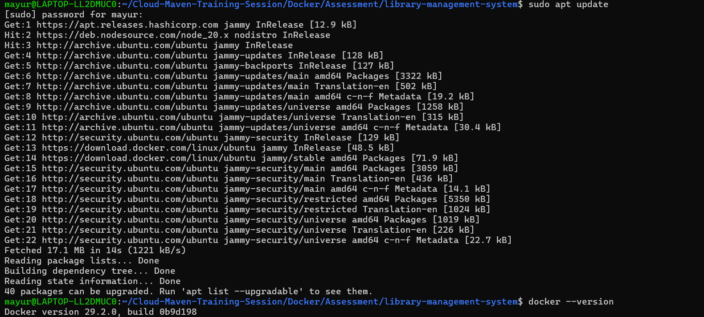
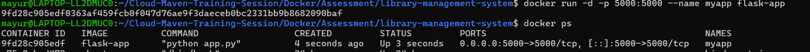
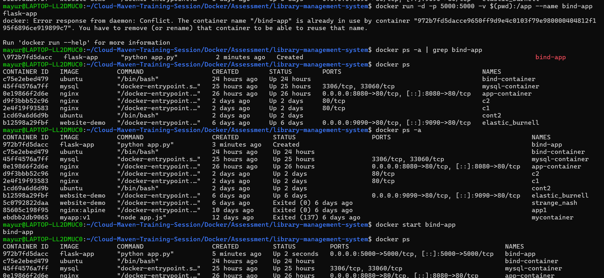
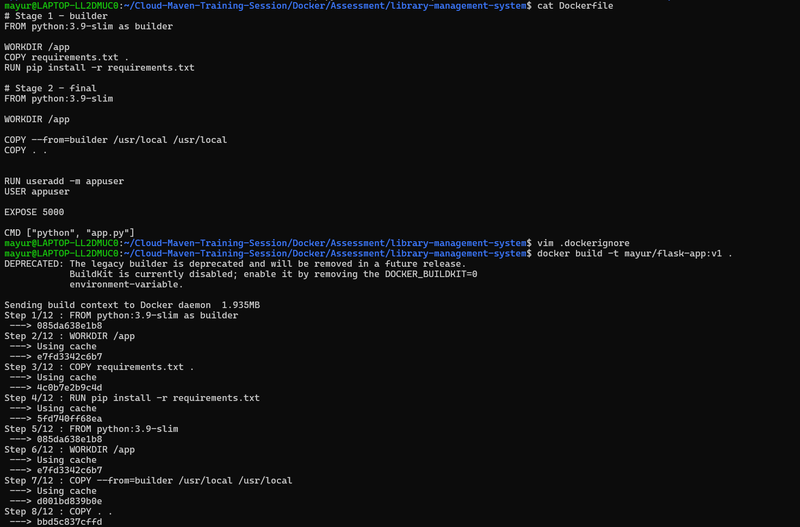
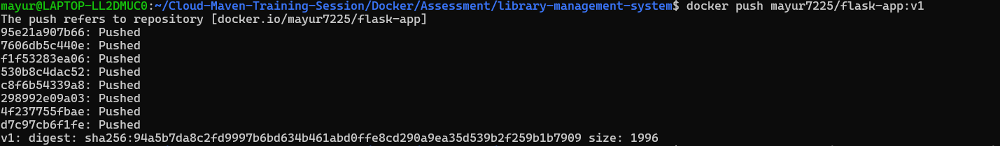
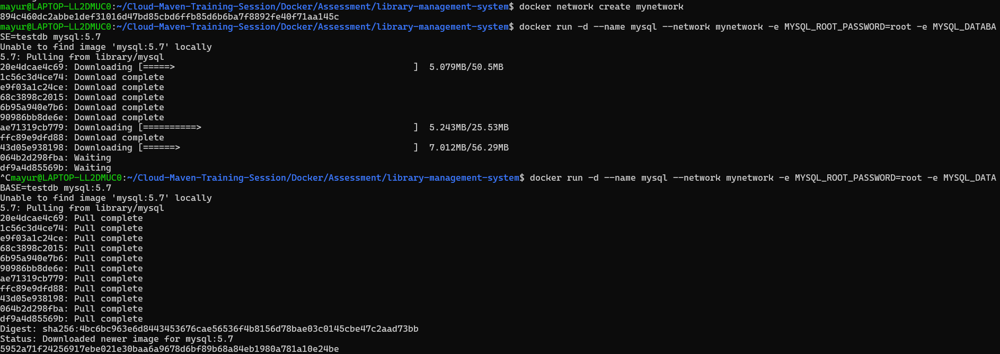
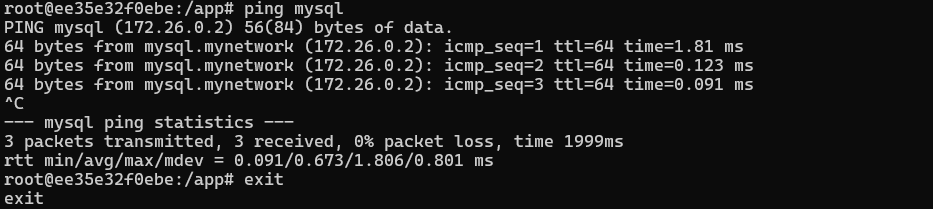

# Docker Assessment – Library Management System

## 📌 Overview

In this task, I containerized a Flask-based Library Management System using Docker.
I worked on Docker basics, custom image creation, networking, security, and Docker Compose setup.

---

# 🧱 1. Docker Basics

* Installed Docker and verified setup
* Ran Flask app using Docker container
* Performed basic commands:

  * start, stop, remove
  * logs, exec, inspect

### 📸 Screenshots

 


---

# 📂 Volume Usage

## 🔹 Bind Mount

Used bind mount to connect local code with container:

```bash
docker run -v $(pwd):/app ...
```

## 🔹 Named Volume

Used volume for MySQL data persistence:

```yaml
mysql_data:/var/lib/mysql
```

### 📸 Screenshots



---

# 🏗️ 2. Custom Docker Image

* Created multi-stage Dockerfile
* Installed dependencies
* Used non-root user
* Built and pushed image

```bash
docker build -t mayur7225/flask-app:v1 .
docker push mayur7225/flask-app:v1
```

### 📸 Screenshots




---

# 🌐 3. Docker Networking

* Created custom network
* Connected Flask and MySQL containers
* Verified communication

```bash
docker network create mynetwork
```

### 📸 Screenshots





---

# 🔐 4. Security & Resource Control

* Limited CPU and memory
* Used non-root user
* Scanned image using Trivy

```bash
--cpus="1.0" --memory="512m"
```

### 📸 Screenshots


---

# 🐳 Docker Compose

Created docker-compose.yml with:

* Flask app
* MySQL
* Nginx

Features:

* Custom network
* Named volume
* .env file
* restart policy

---

# 🔁 Nginx Setup

Created nginx.conf for reverse proxy:

```nginx
server {
    listen 80;

    location / {
        proxy_pass http://app:5000;
    }
}
```

Access:

```
http://localhost:8000
```

### 📸 Screenshots


---

# 📘 Documentation

## Image vs Container vs Volume vs Network

* Image: application template
* Container: running instance
* Volume: persistent storage
* Network: communication between containers

---

## Docker Cleanup

```bash
docker system prune -a
```

---

## Best Practices

* Use small base image
* Use multi-stage builds
* Avoid root user
* Use .dockerignore
* Keep secrets outside Dockerfile

---

# 🐞 Issues Faced

* Flask container exiting
* Missing dependencies
* Circular import issues
* Port conflicts
* Nginx showing default page

---

# ✅ Fixes

* Fixed Dockerfile
* Resolved circular dependency
* Updated DAO handling
* Fixed port conflicts
* Configured Nginx properly

---

# 🏁 Conclusion

This project helped me understand Docker practically including debugging, networking, and multi-container setup.

---

# 🔗 Docker Hub

mayur7225/flask-app:v1

