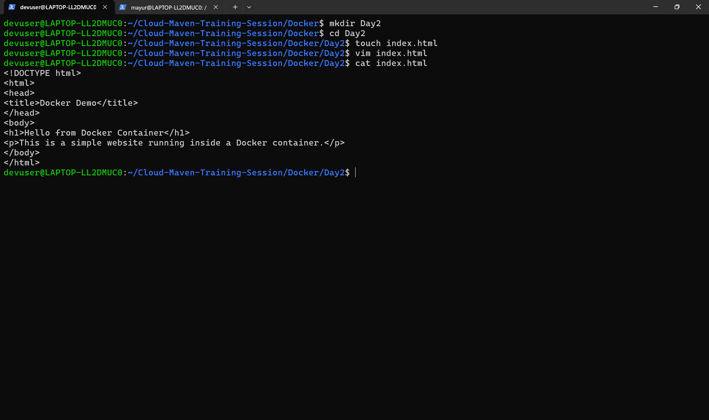
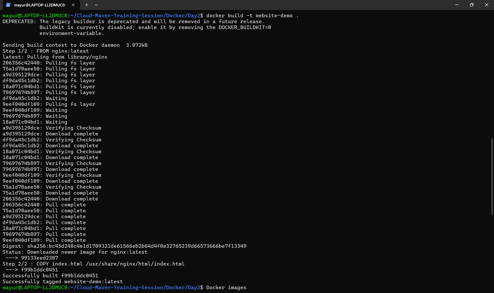
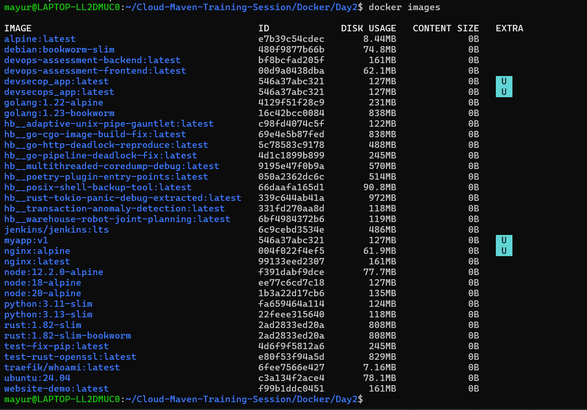
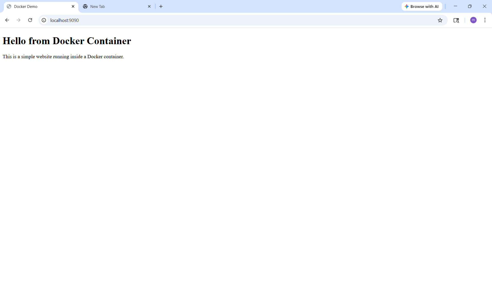
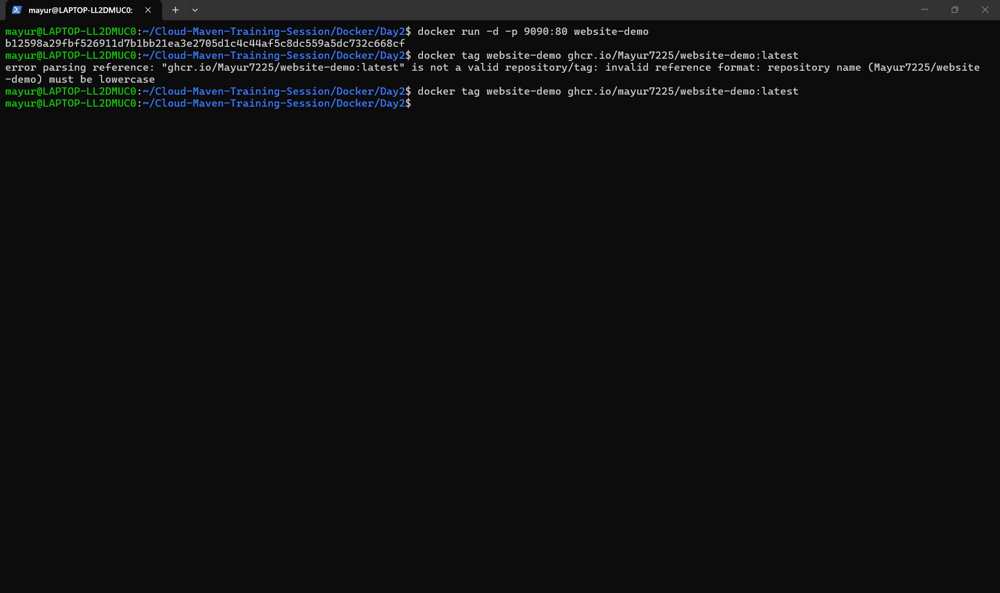

# Docker - Day 2 (Running a Website Using Docker and Publishing Image to GitHub Packages)

## Objective

The objective of this task is to containerize a simple website using Docker, build a Docker image, run the container locally, and push the Docker image to GitHub Container Registry. Finally, create a Pull Request with the implemented changes.

---

# Project Structure

```
Cloud-Maven-Training-Session/
│
├── Docker/
│   └── Day2/
│       ├── Dockerfile
│       ├── index.html
│       └── README.md
```

---

# Step 1: Create a Simple Website

A basic HTML file was created for the website.

Example:

```
index.html
```

```html
<!DOCTYPE html>
<html>
<head>
<title>Docker Demo</title>
</head>
<body>
<h1>Hello from Docker Container</h1>
<p>This is a simple website running inside a Docker container.</p>
</body>
</html>
```

📸 Screenshot: 

---

# Step 2: Create Dockerfile

A Dockerfile was created to package the website inside a container.

```
Dockerfile
```

```dockerfile
FROM nginx:latest
COPY index.html /usr/share/nginx/html/index.html
```

Explanation:

- `FROM nginx:latest` → Uses Nginx as the base image  
- `COPY` → Copies the website file into the Nginx web directory

📸 Screenshot: Dockerfile

---

# Step 3: Build Docker Image

The Docker image was built using the following command:

```
docker build -t website-demo .
```

Explanation:

- `docker build` → Builds the Docker image
- `-t` → Tags the image with a name

📸 Screenshot: 

---

# Step 4: Verify Docker Images

```
docker images
```

This command displays all images available locally.

📸 Screenshot: 

---

# Step 5: Run Docker Container

```
docker run -d -p 8080:80 website-demo
```

Explanation:

- `-d` → Runs container in detached mode
- `-p 8080:80` → Maps port 8080 (host) to port 80 (container)

Now the website can be accessed at:

```
http://localhost:8080
```

📸 Screenshot: 

---

# Step 6: Tag Image for GitHub Container Registry

```
docker tag website-demo ghcr.io/YOUR_GITHUB_USERNAME/website-demo:latest
```

Explanation:

Tags the image so it can be pushed to GitHub Container Registry.

📸 Screenshot: 

---

# Step 7: Login to GitHub Container Registry

```
echo $GITHUB_TOKEN | docker login ghcr.io -u YOUR_GITHUB_USERNAME --password-stdin
```

Explanation:

Authenticates Docker with GitHub Container Registry.

📸 Screenshot: 

---

# Step 8: Push Image to GitHub Packages

```
docker push ghcr.io/YOUR_GITHUB_USERNAME/website-demo:latest
```

Explanation:

Uploads the Docker image to GitHub Container Registry.

📸 Screenshot: [

---

# Step 9: Verify Image on GitHub

The pushed image can be viewed in GitHub under:

```
Packages → Container Registry
```

📸 Screenshot: 

---

# Step 10: Create Pull Request

Steps followed:

1. Created a new branch
2. Added Docker Day2 files
3. Committed the changes
4. Pushed the branch to GitHub
5. Created a Pull Request

Commands used:

```
git checkout -b docker-day2
git add .
git commit -m "Added Docker Day2 website containerization"
git push origin docker-day2
```

📸 Screenshot: 

---

# Conclusion

In this task we learned how to:

- Containerize a simple website using Docker
- Build and run a Docker container
- Push Docker images to GitHub Container Registry
- Create a Pull Request with the changes
