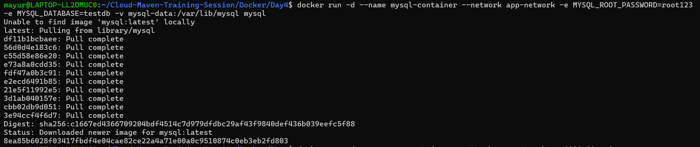
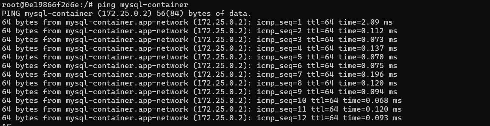
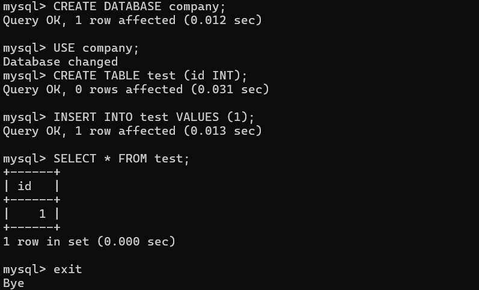
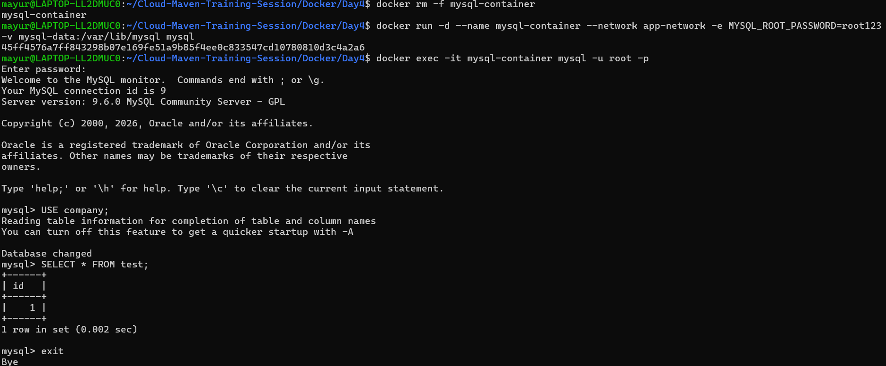
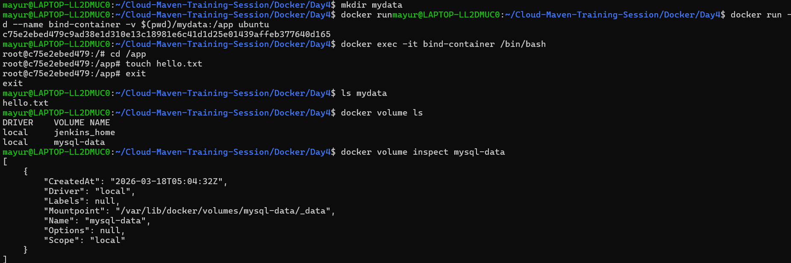

# 🚀 Docker Day 4 - Volumes, Networking & Real Application

## 📌 Overview

In Day 4, I implemented a real-world Docker setup using volumes and networking.
This includes database persistence, bind mounts, custom networks, and container communication.

---

## 📦 Tasks Completed

* Created named Docker volume
* Used bind mounts (host ↔ container)
* Persisted MySQL database data
* Created custom Docker network
* Connected multiple containers
* Tested container-to-container communication
* Debugged Docker network and containers

---

## 🧱 Project Architecture

* MySQL Container (Database)
* Nginx Container (App simulation)
* Docker Volume (Persistent Storage)
* Custom Network (Container Communication)

---

## 🔹 Step 1: Create Volume

```bash
docker volume create mysql-data
```

📸 Screenshot:


---

## 🔹 Step 2: Create Network

```bash
docker network create app-network
```

📸 Screenshot:


---

## 🔹 Step 3: Run MySQL Container

```bash
docker run -d \
--name mysql-container \
--network app-network \
-e MYSQL_ROOT_PASSWORD=root123 \
-e MYSQL_DATABASE=testdb \
-v mysql-data:/var/lib/mysql \
mysql
```

📸 Screenshot:


---

## 🔹 Step 4: Run App Container

```bash
docker run -d \
--name app-container \
--network app-network \
-p 8080:80 \
nginx
```

📸 Screenshot:


---

## 🔗 Step 5: Test Container Communication

```bash
docker exec -it app-container /bin/bash
ping mysql-container
```

📸 Screenshot:


---

## ⚠️ Issue Faced

### ❌ ping not found

* Nginx container did not have ping installed

### ✅ Solution

```bash
apt update
apt install iputils-ping -y
```

---

## 💾 Step 6: Database Persistence

```bash
docker exec -it mysql-container mysql -u root -p
```

```sql
CREATE DATABASE company;
USE company;
CREATE TABLE test (id INT);
INSERT INTO test VALUES (1);
SELECT * FROM test;
```

📸 Screenshot:


---

## 🔁 Step 7: Verify Persistence

* Deleted container
* Recreated container
* Data remained intact

📸 Screenshot:


---

## 📂 Step 8: Bind Mount

```bash
docker run -itd \
--name bind-container \
-v $(pwd)/mydata:/app \
ubuntu
```

📸 Screenshot:


---

## 🔍 Debug & Inspect

```bash
docker volume inspect mysql-data
docker network inspect app-network
docker inspect mysql-container
```

📸 Screenshot:


---

## 🧠 Key Learnings

* Docker volumes ensure persistent storage
* Volume names are case-sensitive
* Containers communicate using network names
* Minimal images may not include debugging tools
* Bind mounts sync host and container files

---

## 📌 Conclusion

This project demonstrates how Docker volumes and networking are used in real-world applications to ensure data persistence and inter-container communication.

---

