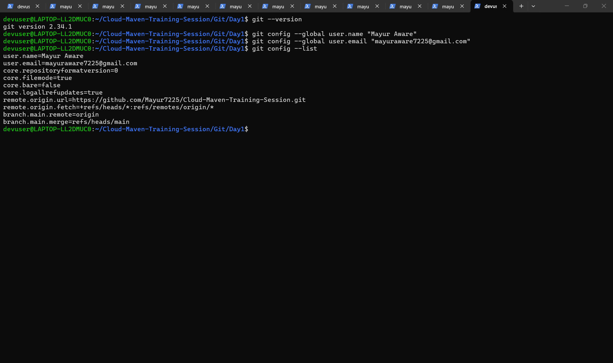
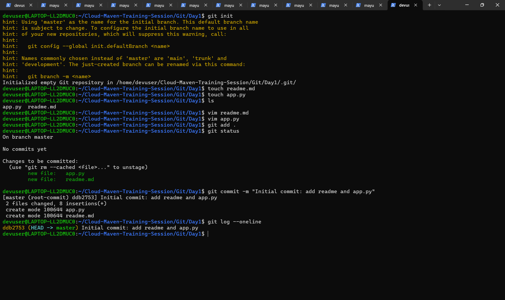

# Git Training – Day 1

## Overview

This lab demonstrates the basic usage of Git for version control including repository initialization, configuration, staging, committing changes, and working with branches.

---

## 1. Git Installation

Verified Git installation on the system.

Command used:

```
git --version
```

Example Output:

```
git version 2.x.x
```

## Screenshots

### Git Version

---

## 2. Git Configuration

Configured global username and email for commits.

```
git config --global user.name "Mayur Aware"
git config --global user.email "mayuraware7225@gmail.com"
```

Verify configuration:

```
git config --list
```

---

## 3. Creating Project Directory

Created a directory for Git practice.

```
mkdir git-training
cd git-training
```

---

## 4. Initialize Git Repository

Initialized a Git repository inside the project directory.

```
git init
```

This creates a hidden `.git` directory which tracks all changes in the repository.

---

## 5. Creating Project Files

Created two files:

```
touch readme.md
touch app.py
```

Example Python file:

```
print("Hello Git Training")
```

## Screenshot


---

## 6. Staging Files

Checked file status:

```
git status
```

Added files to the staging area:

```
git add .
```

---

## 7. Commit Changes

Created the first commit.

```
git commit -m "Initial commit: add readme and app.py"
```

View commit history:

```
git log --oneline
```

---

## 8. Creating a Feature Branch

Created a new branch for making updates.

```
git checkout -b feature/update-readme
```

Verified branch:

```
git branch
```

---

## 9. Updating README

Modified the README file and committed the changes.

```
git add .
git commit -m "Update README from feature branch"
```

---

## 10. Push Branch to Remote Repository

Connected local repository to GitHub and pushed the changes.

```
git remote add origin https://github.com/Mayur7225/Cloud-Maven-Training-Session.git
git push -u origin master
git push -u origin feature/update-readme
```

---

## 11. Pull Request

Created a Pull Request from `feature/update-readme` branch to `master` branch following Git best practices.

---

## Repository Structure

```
Cloud-Maven-Training-Session
 ├── Linux
 └── Git
      └── Day1
           ├── README.md
           └── app.py
```

---

## Key Concepts Learned

* Git initialization
* Staging and committing files
* Viewing commit history
* Branch creation
* Feature branch workflow
* Creating Pull Requests

---

## Conclusion

This lab helped in understanding the basic Git workflow including repository setup, committing changes, branch management, and collaboration using Pull Requests.

