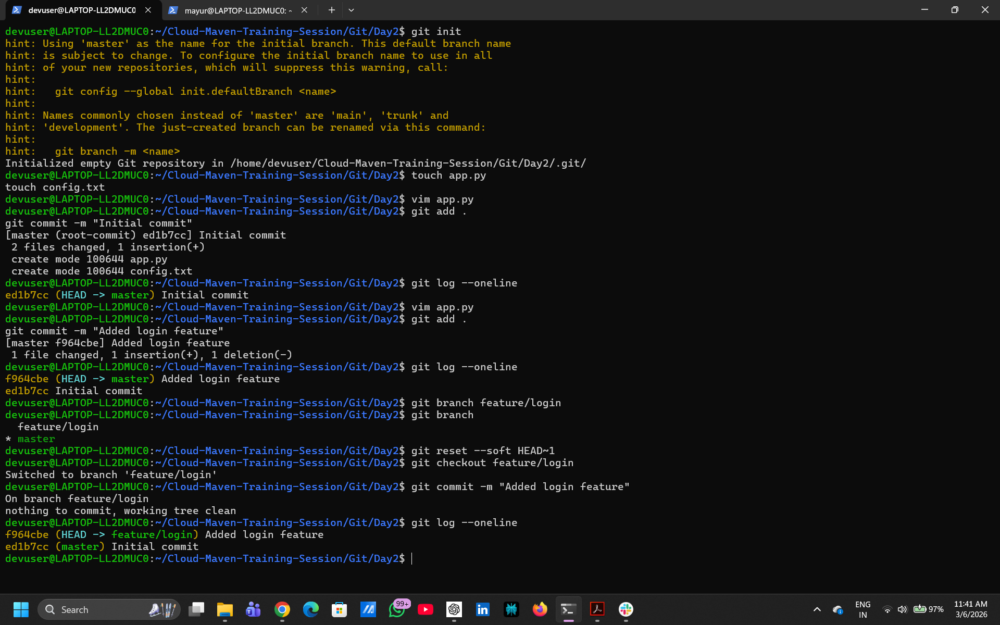
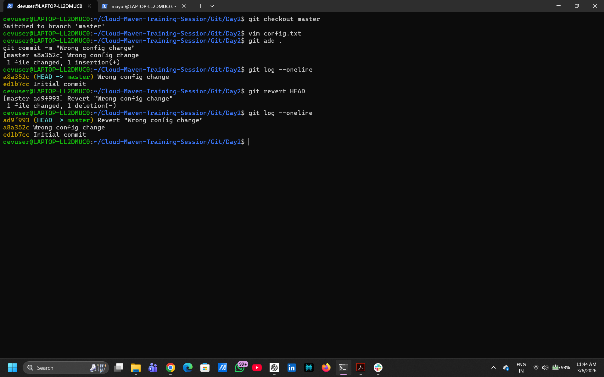
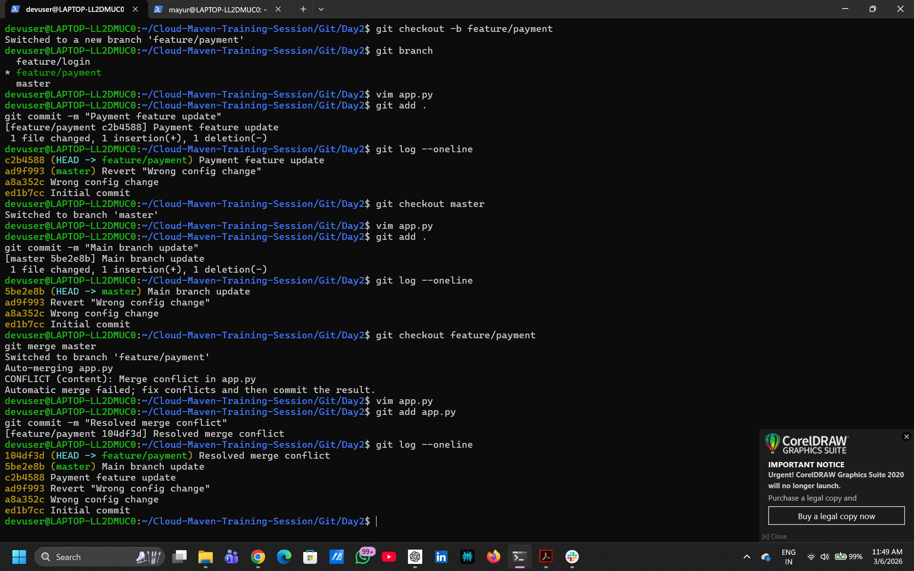

# Git Day2 Practical

## Scenario 1 - Wrong Branch Commit

Moved commit from master to feature/login using git reset --soft.

Commands used:
git branch
git reset --soft HEAD~1
git checkout feature/login

Screenshot:

## Scenario 2 - Bad Commit Already Pushed

Reverted wrong commit safely using git revert.

Commands used:
git revert HEAD

Screenshot:

## Scenario 3 - Merge Conflict

Created merge conflict and resolved manually.

Commands used:
git merge master
git status
git add
git commit

Screenshot:

