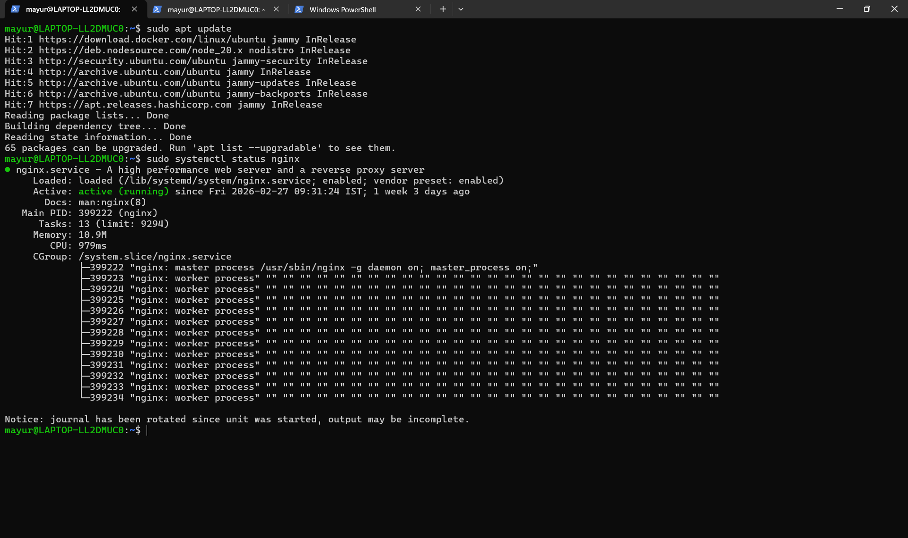
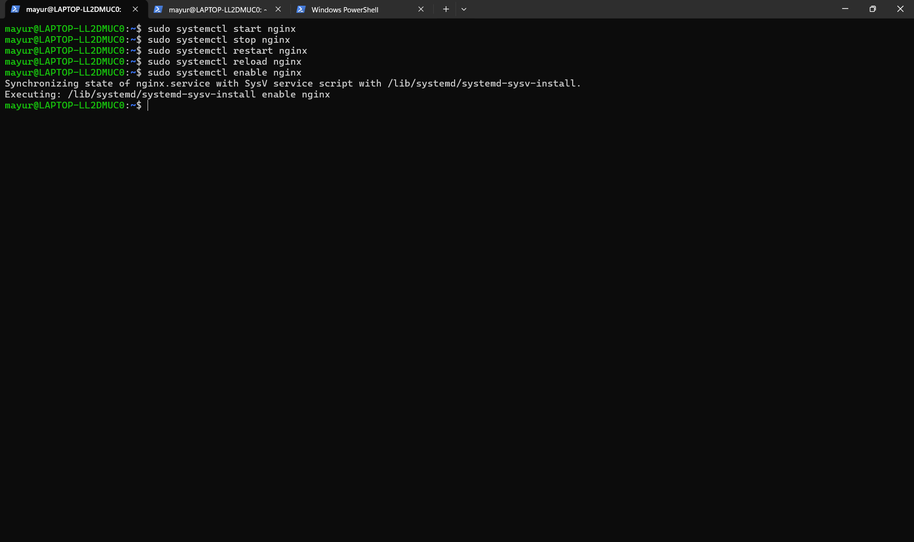
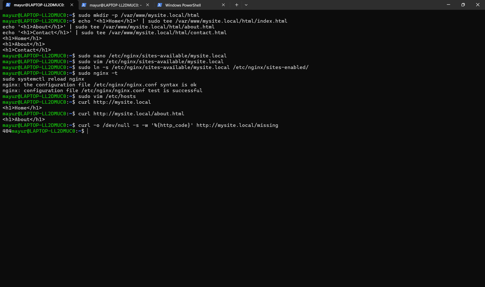
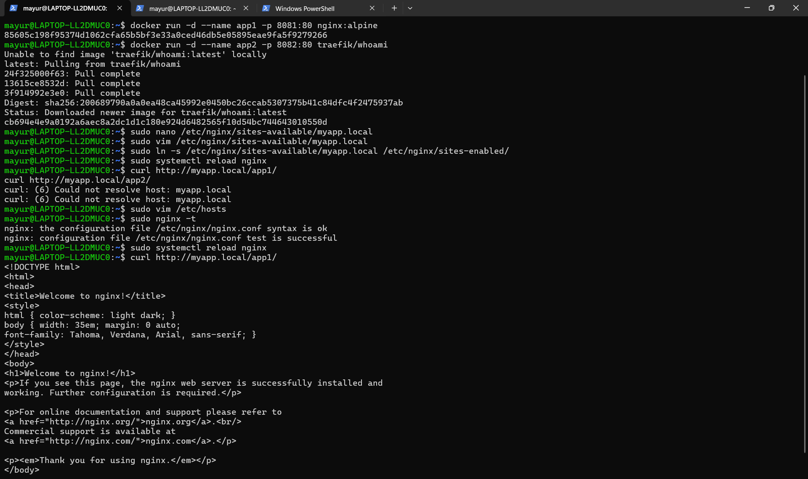
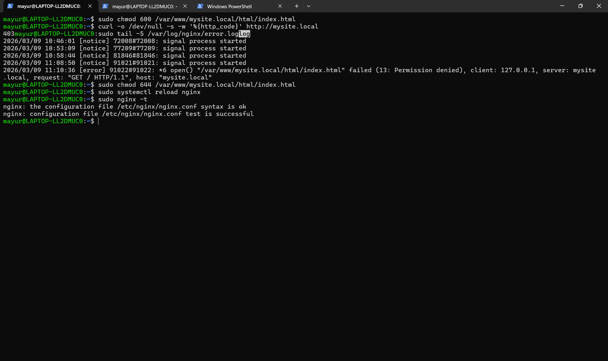

# NGINX Day3 Practical

## T1 – Install and Manage NGINX

Installed NGINX and verified the welcome page.

Commands used:
sudo apt update
sudo apt install nginx
sudo systemctl start nginx
sudo systemctl stop nginx
sudo systemctl restart nginx
sudo systemctl reload nginx
sudo systemctl enable nginx

Screenshot:

---

# T2 – Explore NGINX Configuration

Checked main configuration file and contexts.

Commands:
cat /etc/nginx/nginx.conf
grep -E 'worker_processes|worker_connections' /etc/nginx/nginx.conf
ls -la /etc/nginx/sites-enabled/

Screenshot:

---

# T3 – Host a Static Website

Created a website under `/var/www/mysite.local`.

Commands:
sudo mkdir -p /var/www/mysite.local/html
echo '<h1>Home</h1>' > index.html
echo '<h1>About</h1>' > about.html
echo '<h1>Contact</h1>' > contact.html

Test:
curl http://mysite.local

curl http://mysite.local/about.html

Screenshot:

---

# T4 – Reverse Proxy with Docker

Ran two containers and proxied them using NGINX.

Commands:
docker run -d --name app1 -p 8081:80 nginx:alpine
docker run -d --name app2 -p 8082:80 traefik/whoami

Proxy config:
location /app1/ {
proxy_pass http://127.0.0.1:8081/
;
}

location /app2/ {
proxy_pass http://127.0.0.1:8082/
;
}

Screenshot:

---

# T5 – Multiple Virtual Hosts

Created two sites:
app1.local
app2.local

Configured hosts file and server blocks.

Screenshot:

---

# T6 – Troubleshooting NGINX Errors

Tested common errors.

### 403 Forbidden
chmod 600 index.html

Screenshot:

### 502 Bad Gateway

Changed proxy port to unused port.

Screenshot:

---

# Conclusion

Completed NGINX installation, configuration, hosting, reverse proxy setup with Docker, and troubleshooting common errors.
