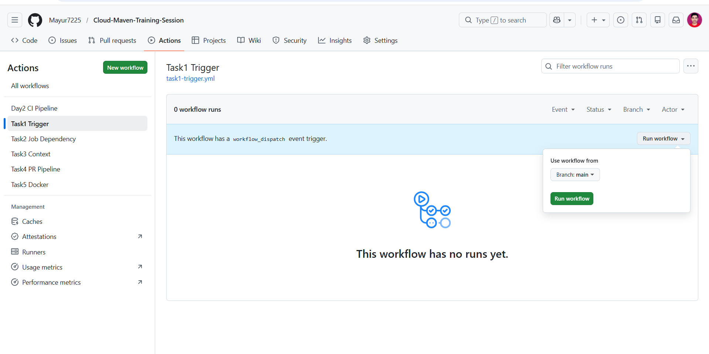
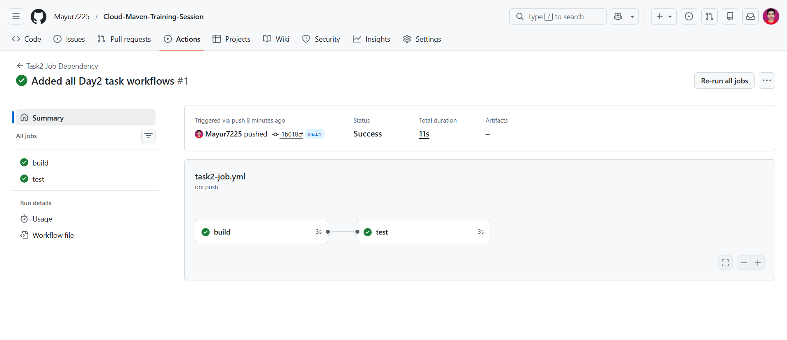
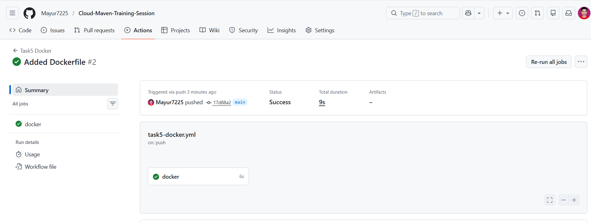

# 🚀 GitHub Actions - Day 2 (Workflow Implementation)

## 📌 Overview

In this task, I implemented multiple GitHub Actions workflows to understand:

* Workflow triggers
* Job dependencies
* Context variables
* Pull Request validation
* Docker build process

---

## 📁 Workflow Files

All workflow files are placed in:

```bash
.github/workflows/
```

### Files created:

* task1-trigger.yml
* task2-job.yml
* task3-context.yml
* task4-pr.yml
* task5-docker.yml

---

## ⚙️ Implementations

### ✅ Task 1: Trigger Configuration

* Workflow runs on:

  * Pull Request (main branch)
  * Manual trigger

```yaml
on:
  pull_request:
    branches:
      - main
  workflow_dispatch:
```

---

### ✅ Task 2: Job Dependency

* Build runs first
* Test runs after build using `needs`

```yaml
jobs:
  test:
    needs: build
```

---

### ✅ Task 3: Context Variables

* Printed:

  * Branch name
  * Commit ID

```yaml
echo "Branch: ${{ github.ref }}"
echo "Commit: ${{ github.sha }}"
```

---

### ✅ Task 4: PR Workflow

* Pipeline runs on Pull Request
* Ensures build and test before merge

---

### ✅ Task 5: Docker Build

* Docker image built using Dockerfile

```bash
docker build -t myapp:latest .
```

---

## 🐳 Dockerfile

```dockerfile
FROM ubuntu:latest
CMD ["echo", "Hello from Docker CI"]
```

---

## 📸 Screenshots

### 🔹 Workflow Success



### 🔹 Jobs Running



### 🔹 Docker Build Output



---

## 🎯 Learning Outcomes

* Understood GitHub Actions workflow structure
* Learned how triggers work (push, PR, manual)
* Implemented job dependencies using `needs`
* Used GitHub context variables
* Built Docker image in CI pipeline

---

## 🚀 Conclusion

GitHub Actions helps automate CI pipelines by running workflows on code changes.
This improves development speed and ensures code quality.

---

## 📌 Status

✅ Day 2 Completed

