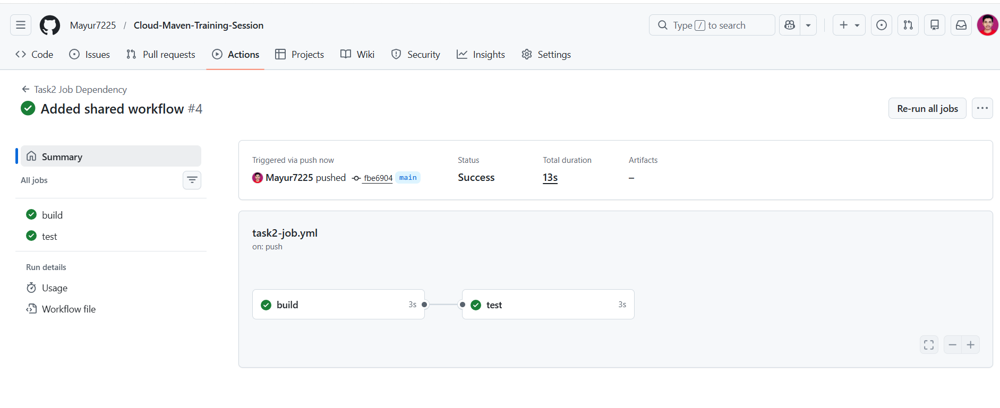
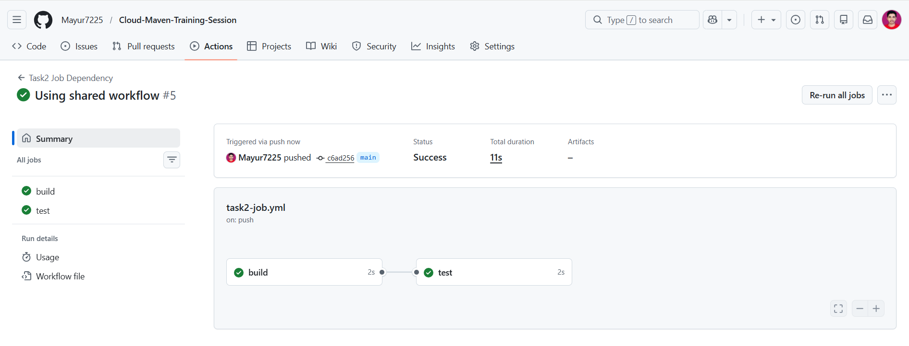
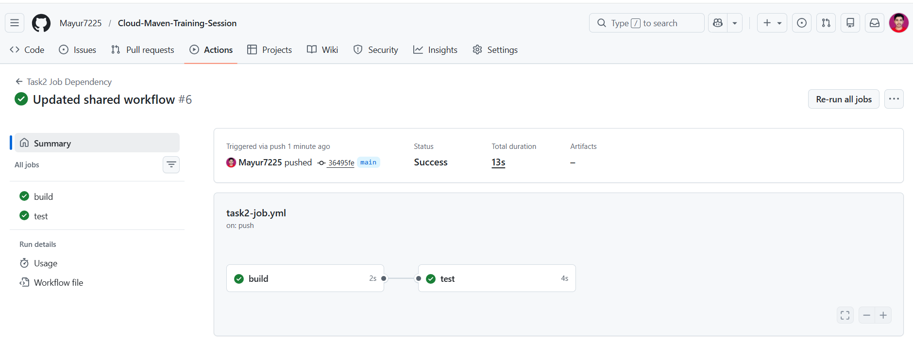

# 🚀 GitHub Actions - Day 4 (Shared Workflows)

## 📌 Overview

In this task, I implemented **GitHub Shared Workflows** to reuse CI/CD pipelines across workflows.

Shared workflows allow us to define CI logic once and reuse it in multiple workflows, improving consistency and reducing duplication.

---

## 🧠 What are Shared Workflows?

Shared workflows are reusable GitHub Actions workflows that can be called from other workflows using `workflow_call`.

👉 Key Benefits:

* Reusability (write once, use everywhere)
* Consistency across projects
* Easy maintenance
* Reduced duplication

---

## 📁 Project Structure

```bash
.github/workflows/
│
├── shared-ci.yml        # Shared reusable workflow
├── use-shared.yml       # Calls shared workflow
```

---

## ⚙️ Implementation

---

### ✅ Task 1: Create Shared Workflow

📄 File: `shared-ci.yml`

```yaml
name: shared-ci-quality-check

on:
  workflow_call:

jobs:
  quality-check:
    runs-on: ubuntu-latest

    steps:
      - uses: actions/checkout@v4

      - name: Run CI Check
        run: echo "Running Shared CI Quality Check"
```

---

### 💡 Explanation

* `workflow_call` makes the workflow reusable
* Contains CI steps like build/test/checks

---

### ✅ Task 2: Use Shared Workflow

📄 File: `use-shared.yml`

```yaml
name: use-shared-ci

on:
  push:
    branches:
      - main

jobs:
  run-shared-ci:
    uses: Mayur7225/Cloud-Maven-Training-Session/.github/workflows/shared-ci.yml@main
```

---

### 💡 Explanation

* `uses:` is used to call the shared workflow
* Executes reusable CI pipeline

---

### ✅ Task 3: Modify Shared Workflow

Updated shared workflow:

```yaml
run: echo "Shared workflow updated!"
```

👉 Result:

* Changes automatically reflected in calling workflow

---

## 📸 Screenshots

### 🔹 Shared Workflow Execution



### 🔹 Calling Workflow Run



### 🔹 Updated Output



---

## 🎯 Learning Outcomes

* Understood reusable workflows using `workflow_call`
* Learned how to call workflows using `uses`
* Implemented centralized CI logic
* Observed real-time impact of shared workflow updates

---

## 🚀 Conclusion

Shared workflows help standardize CI/CD pipelines across projects and reduce repetitive code.

They are widely used in organizations for maintaining consistent DevOps practices.

---

## 📌 Status

✅ Day 4 Completed

