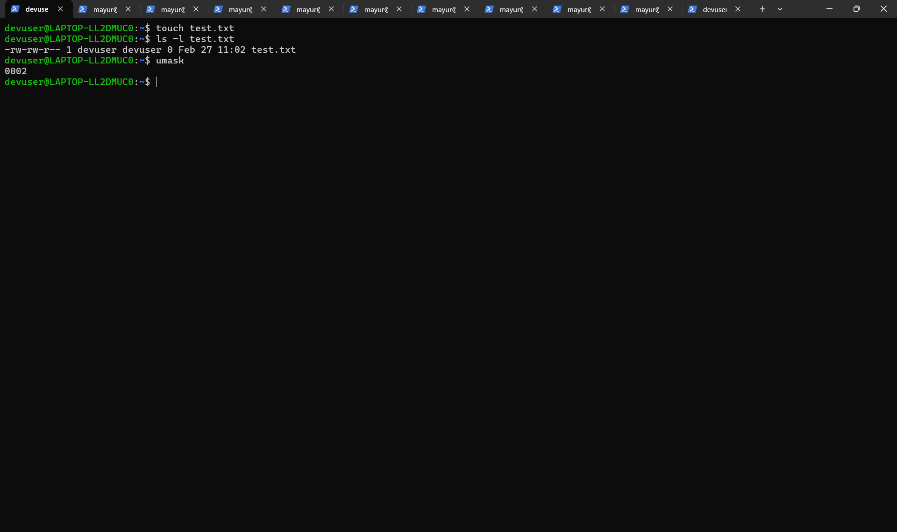
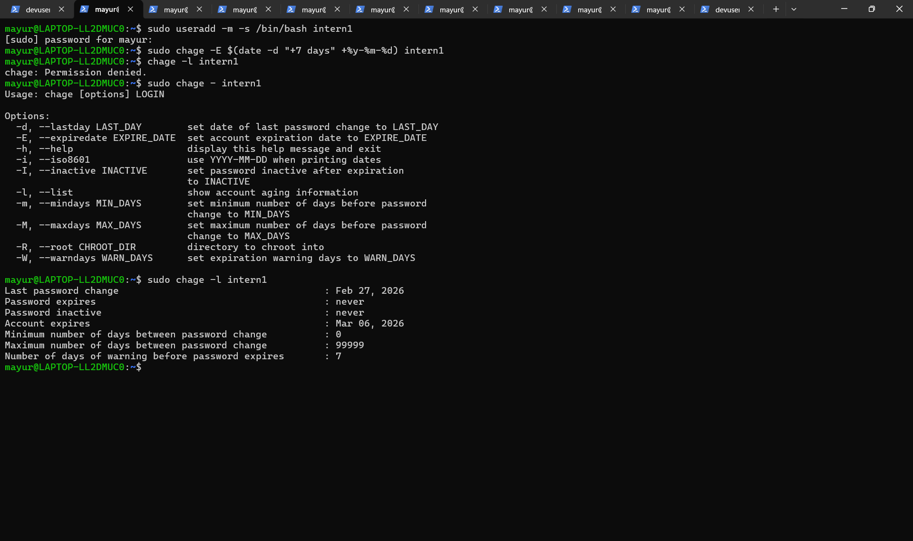
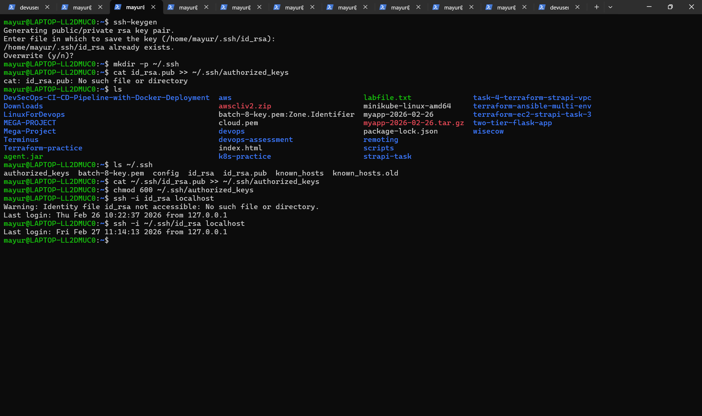
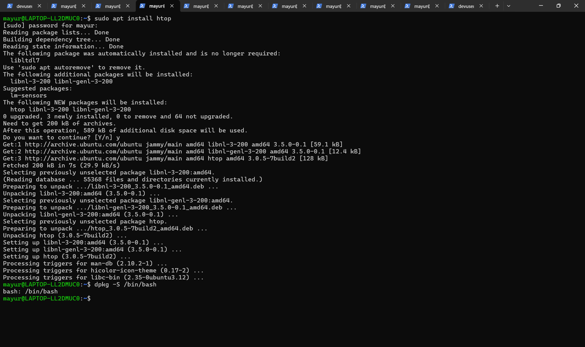
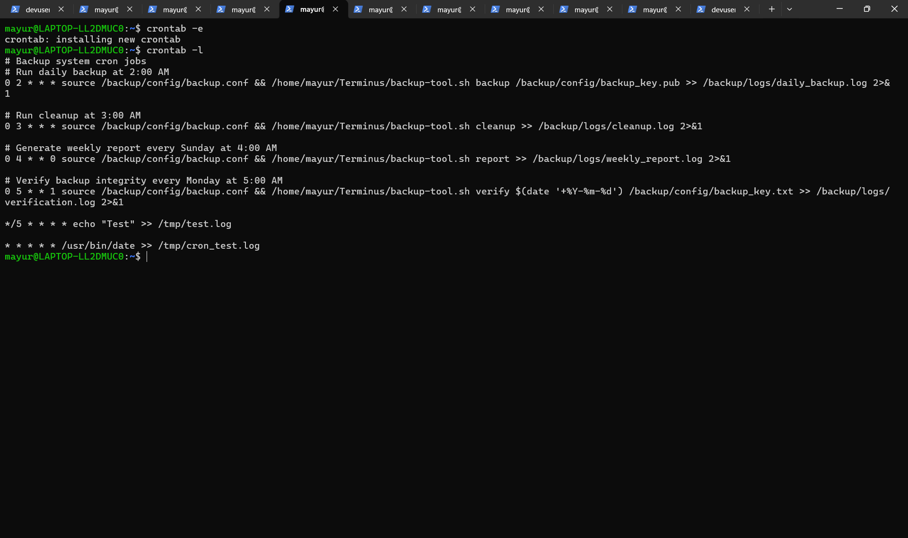
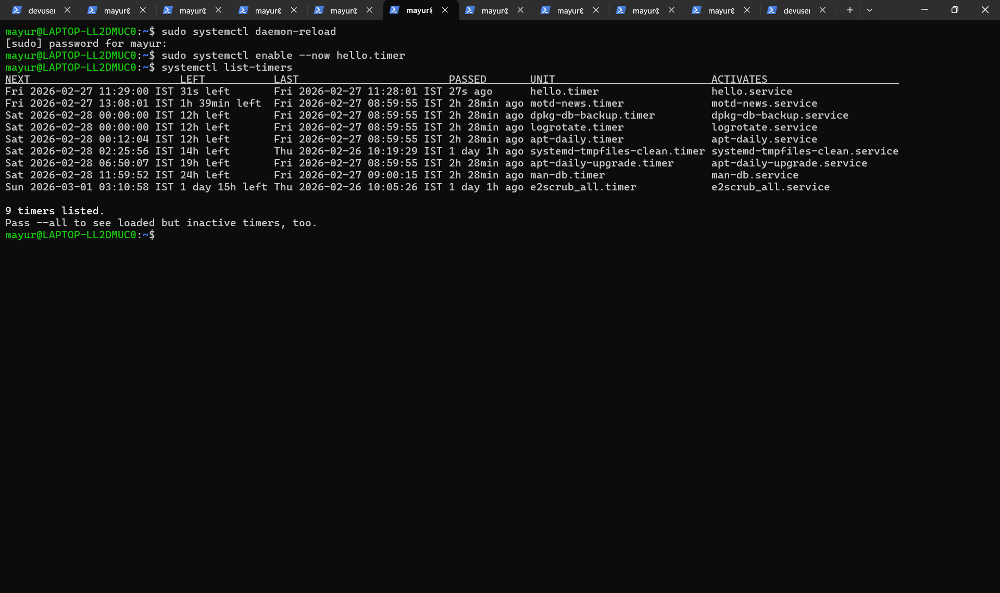
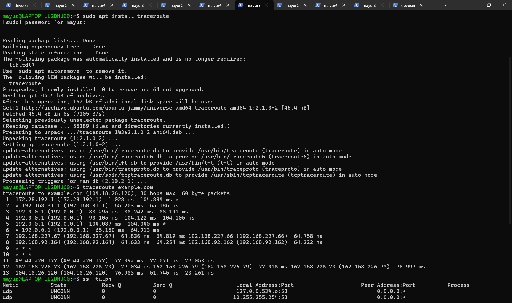
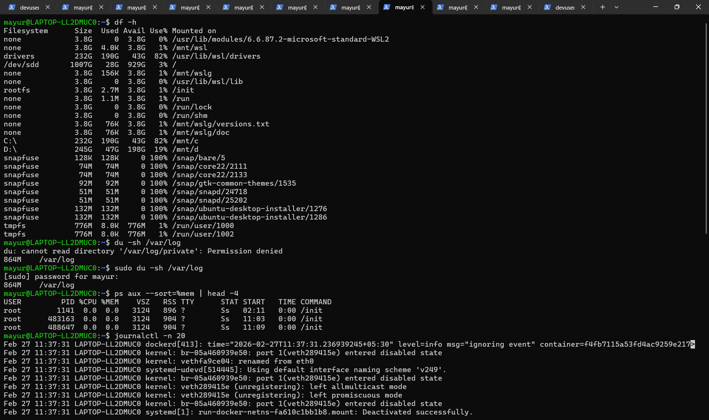

# 🐧 Linux Weekly Assessment

## 📌 Overview

This assessment demonstrates practical Linux system administration skills including:

- File permissions & umask
- User management
- SSH key-based authentication
- Package management
- Cron jobs
- Systemd timers
- Networking & tcpdump
- Monitoring & logs
- Bash scripting

All tasks were performed on Ubuntu Linux.

---

# 1️⃣ Permissions & umaskk

### Commands Used
```bash
touch test.txt
umask
ls -l test.txt
```
Explanation

Default file permission = 666

umask subtracts permission bits

Example: 666 - 022 = 644

Screenshot:

# 2️⃣ User Management
Commands Used
```
sudo useradd -m -s /bin/bash intern1
sudo chage -E YYYY-MM-DD intern1
sudo chage -l intern1
```
Explanation

Created user with bash shell

Account configured to expire in 7 days

Screenshot:

# 3️⃣ SSH Key-Based Authentication
Commands Used
```
ssh-keygen
cat ~/.ssh/id_rsa.pub >> ~/.ssh/authorized_keys
chmod 600 ~/.ssh/authorized_keys
ssh localhost
```
Explanation

Generated SSH keypair

Enabled passwordless login

Screenshot: 

# 4️⃣ Package Management
Commands Used
```
sudo apt install htop
dpkg -S /bin/bash
```
Explanation

Installed htop

Verified package ownership of /bin/bash

Screenshot: 

# 5️⃣ Cron Job
Command Added in crontab
```
* * * * * /usr/bin/date >> /tmp/cron_test.log
```
Verification
```
crontab -l
```

Screenshot:  

# 6️⃣ Systemd Timer
Created:

hello.service

hello.timer

Commands
```
sudo systemctl daemon-reload
sudo systemctl enable --now hello.timer
systemctl list-timers
```
Screenshot: 

# 7️⃣ Networking
Commands Used
```
ping -c 1 8.8.8.8
traceroute example.com
ss -tuln
sudo tcpdump -i any tcp port 80 -c 5 -w http.pcap
curl http://localhost
```
Screenshot: 

# 8️⃣ Monitoring & Logs
Commands Used
```
df -h
du -sh /var/log
ps aux --sort=-%mem | head -4
journalctl -n 20
tail -n 20 /var/log/syslog
```
Screenshot: 

# 9️⃣ Bash Script – Disk Check
Script Location:
```
/tmp/check_disk.sh
```
Script
```
#!/bin/bash

usage=$(df / | awk 'NR==2 {print $5}' | tr -d '%')

if [ "$usage" -gt 80 ]; then
    echo "Disk almost full" >&2
    exit 1
else
    echo "Disk OK"
    exit 0
fi
```
